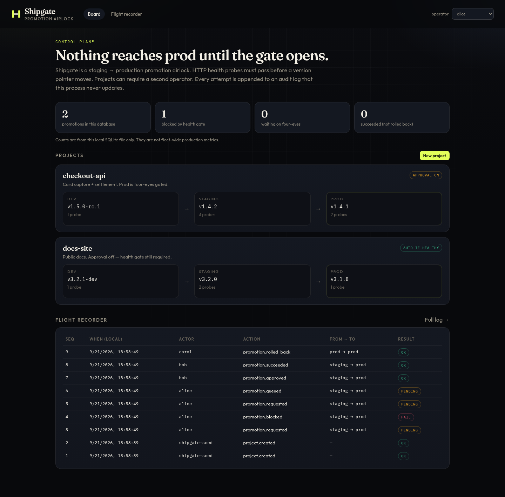
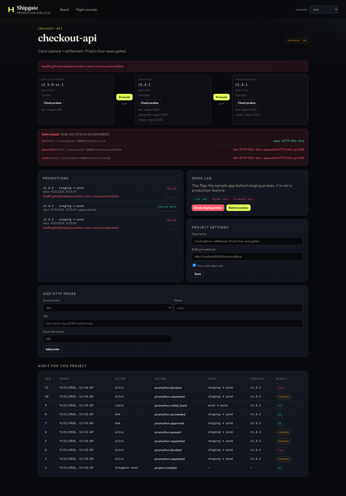
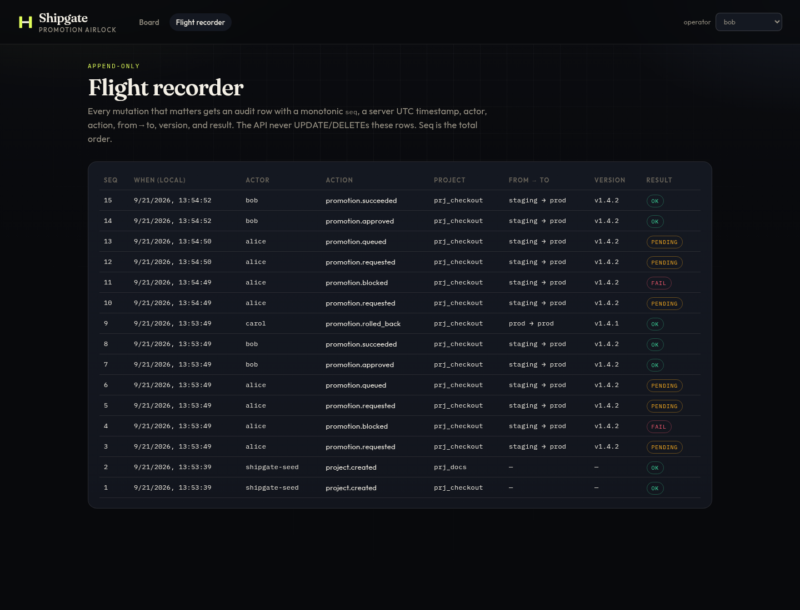

# Shipgate

**Staging → production promotion airlock.** Health probes gate the promote. Optional four-eyes
approval. Rollback webhook. Append-only audit log. Not AI.

```
docker compose up --build
# UI  http://localhost:3000
# API http://localhost:8080
```

Reseed: `docker compose down -v` then up again (SQLite lives in a volume).

## 60-second happy path

You will **fail** a promote on bad health, **pass** it after restore, **approve** as a second
operator, then **rollback**. Audit rows appear for each step.



### UI (Loom this)

1. Open [http://localhost:3000](http://localhost:3000). Operator = `alice`.
2. Click **checkout-api** (approval on). Staging is `v1.4.2`, prod is `v1.4.1`.
3. **Demo lab → Break staging probes.** Ready + payments go 503.
4. Click the **Promote** gate between staging and prod. The gate **closes** (HTTP 409). Probe
   rows show `fail · HTTP 503`. Flight recorder: `promotion.blocked`.


5. **Restore probes.** Promote again. Status **pending approval** (alice cannot approve herself).
6. Switch operator to **bob**. Click **Approve**. Prod version pointer becomes `v1.4.2`.
7. Open **Flight recorder**. You should see `requested → blocked`, then `requested → queued →
   approved → succeeded`, with actor, from→to, version, result.


8. Click **Rollback**. [http://localhost:8090/hooks](http://localhost:8090/hooks) shows the JSON
   payload. Prod pointer returns to `v1.4.1`.

**docs-site** on the board has approval **off**. After probes are healthy, staging→prod succeeds
in one click.

### Curl (same story)

```bash
# 1. Break the sample app
curl -s -X POST http://localhost:8080/api/v1/demo/break \
  -H 'Content-Type: application/json' -d '{"target":"all"}'

# 2. Promote — expect 409 and status=failed
curl -s -D- -H 'X-Actor: alice' -H 'Content-Type: application/json' \
  -d '{"from":"staging","to":"prod"}' \
  http://localhost:8080/api/v1/projects/prj_checkout/promotions

# 3. Restore probes
curl -s -X POST http://localhost:8080/api/v1/demo/restore \
  -H 'Content-Type: application/json' -d '{}'

# 4. Promote — expect 201 status=pending_approval
curl -s -H 'X-Actor: alice' -H 'Content-Type: application/json' \
  -d '{"from":"staging","to":"prod"}' \
  http://localhost:8080/api/v1/projects/prj_checkout/promotions
# copy id from the JSON, then:

# 5. Four-eyes (alice would get 403)
curl -s -H 'X-Actor: bob' -X POST \
  http://localhost:8080/api/v1/promotions/PMT_ID/approve

# 6. Audit
curl -s http://localhost:8080/api/v1/projects/prj_checkout/audit | python3 -m json.tool | head

# 7. Rollback + webhook sink
curl -s -H 'X-Actor: carol' -X POST \
  http://localhost:8080/api/v1/promotions/PMT_ID/rollback
curl -s http://localhost:8090/hooks
```

`scripts/happy-path.sh` runs the curl path against a live stack.

## What you get

| Piece | Where |
| --- | --- |
| Console (projects, env pipeline, promote, approve, audit) | `web/` — Next.js, :3000 |
| API | `api/` — Go 1.22, :8080 |
| Sample app with live/ready/payments probes | `demo-app/` — :8088 |
| Rollback webhook sink | `hooks/` — :8090 |
| Architecture + audit consistency + failure modes | [DESIGN.md](DESIGN.md) |

Seeded projects:

- `checkout-api` (`prj_checkout`) — four-eyes **on**, three staging probes
- `docs-site` (`prj_docs`) — approval **off**, health gate still required

## API sketch

Mutating calls need `X-Actor`. There is no SSO in this MVP (see DESIGN.md).

| Method | Path | Notes |
| --- | --- | --- |
| GET | `/api/v1/healthz` | process + db ping |
| GET | `/api/v1/metrics` | counts from **this** sqlite file only |
| GET/POST | `/api/v1/projects` | create ships dev/staging/prod |
| GET/PATCH | `/api/v1/projects/{id}` | toggle approval, webhook URL |
| POST | `/api/v1/environments/{id}/probes` | HTTP probe |
| POST | `/api/v1/environments/{id}/check` | dry-run probes |
| POST | `/api/v1/projects/{id}/promotions` | 201 queued/succeeded, **409** if gate fails |
| POST | `/api/v1/promotions/{id}/approve` | re-runs probes; four-eyes |
| POST | `/api/v1/promotions/{id}/reject` | |
| POST | `/api/v1/promotions/{id}/rollback` | webhook then pointer restore |
| GET | `/api/v1/audit` | newest `seq` first |

## Rollback hook

On rollback, Shipgate POSTs JSON to the project's `rollback_webhook_url` (seeded to the compose
sink). The hook must return 2xx or Shipgate **does not** move the version pointer. Payload and
failure modes: [DESIGN.md](DESIGN.md#rollback-hook-contract).

To run a script instead: point the URL at a tiny receiver you own that execs the script. Shipgate
does not shell out.

## Local without Docker

```bash
make demo   # demo-app :8088, hooks :8090, api :8080
# other terminal:
make web    # Next dev :3000, proxies /api/v1 → :8080
make test
```

## Tests

`cd api && go test ./...` covers: health gate block then succeed, four-eyes, skip-env rejection,
refuse-without-probes, rollback webhook, webhook failure does not move the pointer, actor required.

## Honest metrics

The board numbers are `SELECT COUNT(*)` on the local database. The API `note` field says so.
Do not put them on a resume as “reduced incident rate by X%”.

## DRAFT resume bullets

Billy polishes before resume use. Do not paste as-is.

- DRAFT: Built Shipgate, a staging→prod promotion control plane (Go API, Next.js console, SQLite)
  with HTTP health gates, optional four-eyes approval, rollback webhooks, and an append-only audit log.
- DRAFT: Applied environment version-pointer changes and audit inserts in a single SQLite
  transaction so a succeeded promote cannot exist without a matching `promotion.succeeded` row.
- DRAFT: Shipped a docker-compose demo whose sample app probes can be failed and restored live,
  with tests for gate block/pass, four-eyes, and “webhook 5xx does not move prod”.
